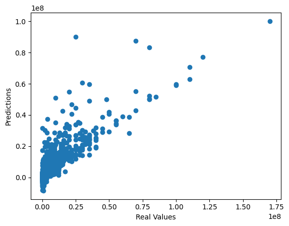
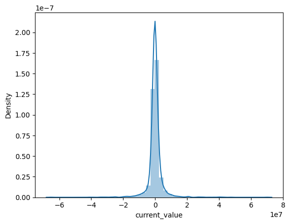

# Use case 7 (Lab)

### Feature Engineering: 
using **one hot coding** on categorical_features
### Hyperparameter Optimization:
using **model.intercept_** = 3612928.704277743

### Performance Metric Visuals:
**Predictions vs. Real Values**

**Residual Histogram**

### Feature and Prediction Insights:
**Feature Importance:**

| Metric                | Value      |
|-----------------------|------------|
| current_value         | 1.000000   |
| highest_value         | 0.834553   |
| minutes played        | 0.420542   |
| appearance            | 0.419656   |
| award                 | 0.300454   |
| assists               | 0.137415   |
| games_injured         | 0.135654   |
| goals                 | 0.121574   |
| days_injured          | 0.107686   |
| position_encoded      | 0.085154   |
| height                | 0.040535   |
| winger                | 0.005034   |
| red cards             | -0.010171  |
| clean sheets          | -0.011684  |
| yellow cards          | -0.011766  |
| second yellow cards   | -0.013889  |
| age                   | -0.050156  |
| goals conceded        | -0.063529  |

**Prediction Interpretation:** i took any value > 0.10 

### Limitations: 
after removing the outliers half of the data was deleted 

data shape befor cleaning: **(10754, 20)**

data shape after cleaning: **(4309, 20)**
