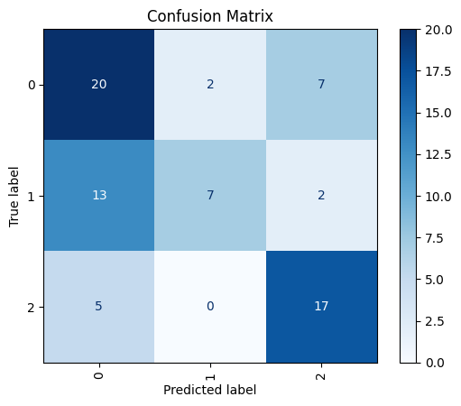
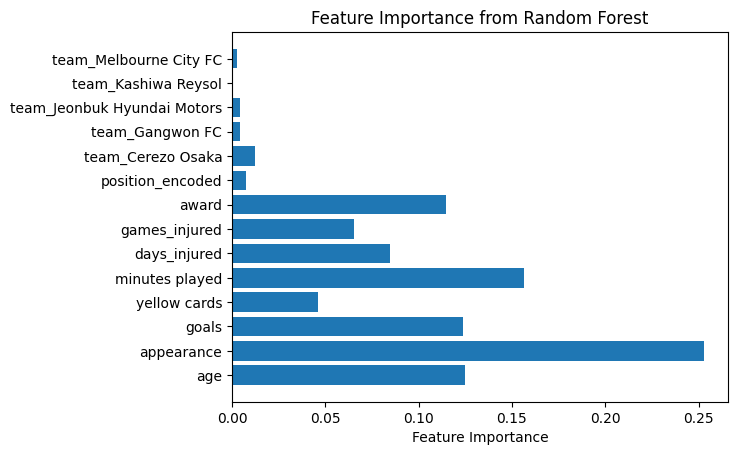

# Use case 7 (Lab)

### model :
**Decision Tree Classifier**
**Random Forest Classifier**
### Feature Engineering: 
using **one hot coding** on categorical_features
### Hyperparameter Optimization:
using **grid search** ={'max_depth': 2, 'n_estimators': 75}

### Performance Metric Visuals:
**Confusion Matrix**

### Feature and Prediction Insights:
**Classification Report**

|           | precision | recall | f1-score | support |
|-----------|-----------|--------|----------|---------|
|         0 |      0.53 |   0.69 |     0.60 |      29 |
|         1 |      0.78 |   0.32 |     0.45 |      22 |
|         2 |      0.65 |   0.77 |     0.71 |      22 |
| accuracy  |           |        |     0.60 |      73 |
| macro avg |      0.65 |   0.59 |     0.59 |      73 |
| weighted avg |  0.64 |   0.60 |     0.59 |      73 |

### Limitations: 
after removing the outliers 500 rowas was deleted 

data shape befor cleaning: **(10754, 19)**

data shape after cleaning: **(10247, 19)**

### Feature importance from Random Forest:
